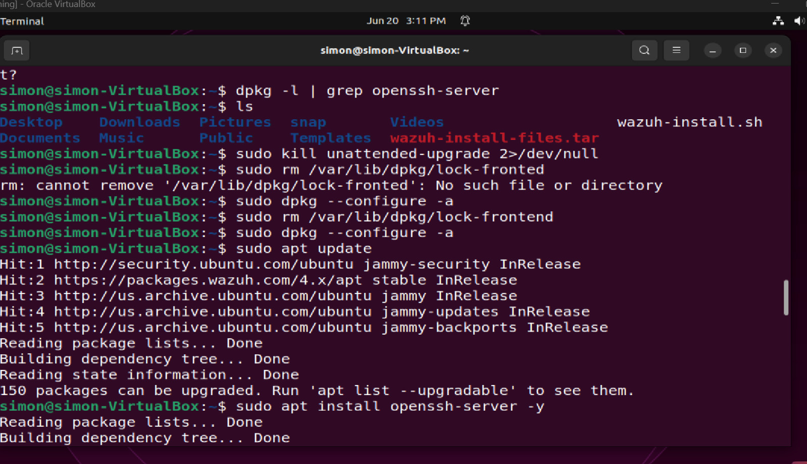
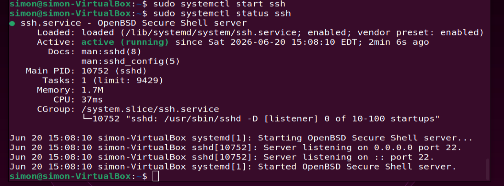
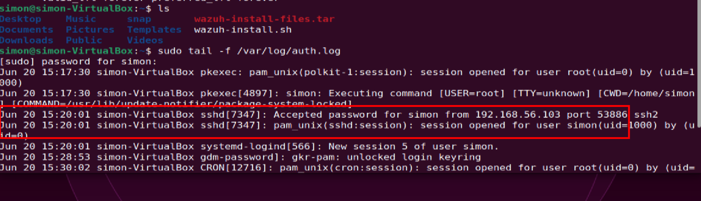
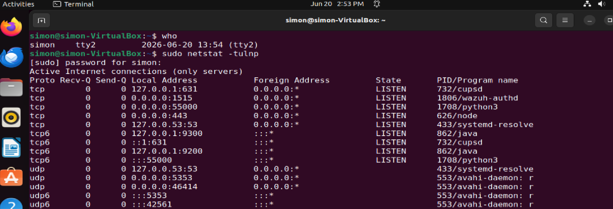
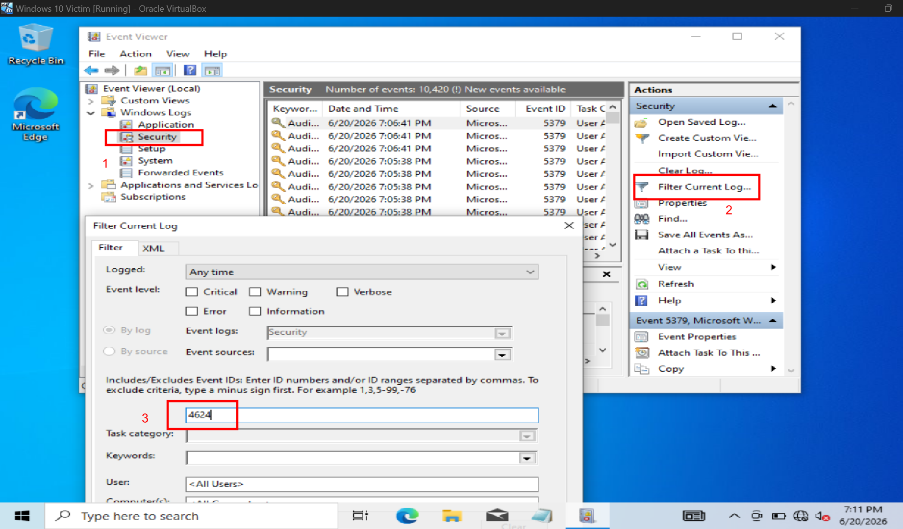
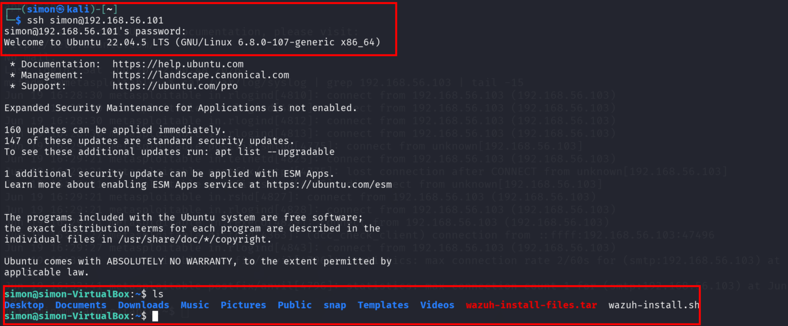

# Day 5: Log Monitoring & Detection

**Date:** 2026-04-20  
**Goal:** Detect and analyze authentication logs from Linux SSH and Windows RDP using a lab setup.

### Lab Setup
VirtualBox lab with 3 VMs:
- **Attacker:** Kali Linux
- **Target 1:** Ubuntu Desktop - SSH service
- **Target 2:** Windows 10 - RDP service

### Part 1: Linux SSH Log Monitoring

1. **Enable SSH service on Ubuntu**

2. **View authentication logs**
Monitored `/var/log/auth.log` for login attempts

3. **Verify SSH port listening**

### Part 2: Windows RDP Log Monitoring

1. **Filter Event Viewer for successful logons**
Filtered for Event ID 4624

2. **Review successful logon events**

### Key Learnings
- Linux stores SSH logs in `/var/log/auth.log`
- Windows logs RDP logons as Event ID 4624 in Security log
- `netstat -tlnp` confirms SSH is listening on port 22
- Log monitoring is critical for detecting brute force and unauthorized access

### Tools Used
VirtualBox, Ubuntu, Windows 10, Kali Linux, SSH, Event Viewer

### All commands Used

