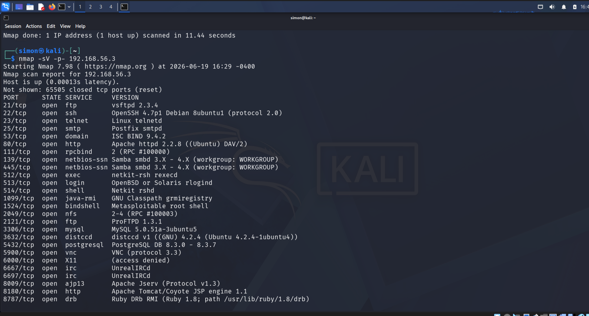
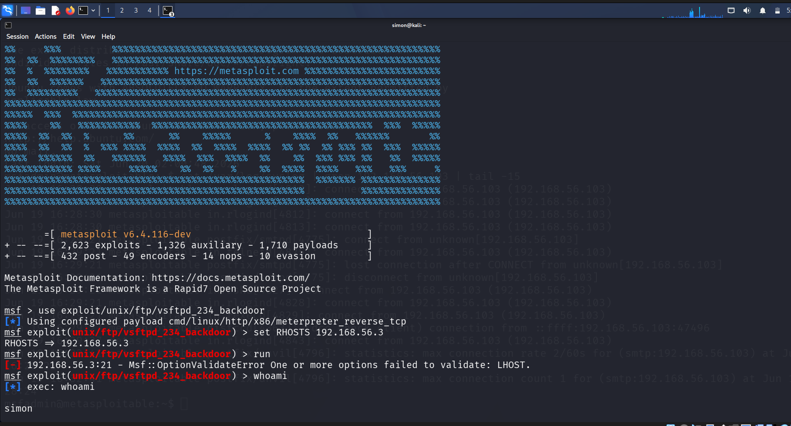
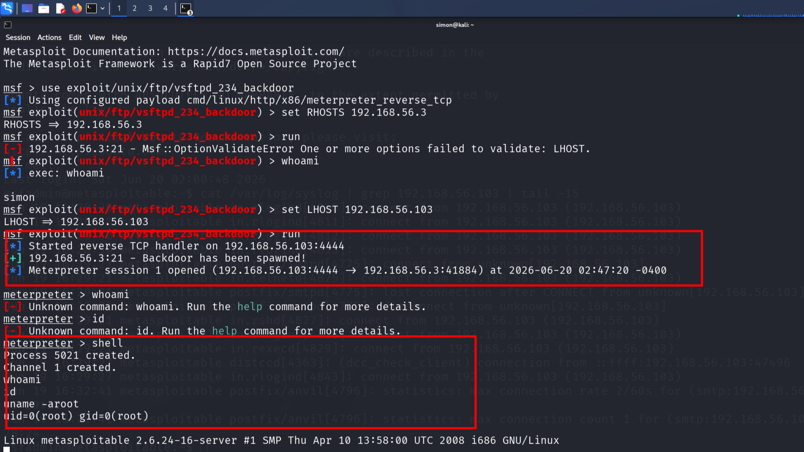

# Cybersecurity Lab Practice

## About This Repo
Personal learning lab for penetration testing and ethical hacking concepts. I document every exercise to track my growth and prepare for cybersecurity roles.

## Disclaimer
**For educational purposes only.** All techniques and tools demonstrated here were tested on virtual machines I own in an isolated home lab environment. I have explicit permission to assess these systems. Unauthorized access to any computer system is illegal and unethical.

## Skills Demonstrated
- **Network Reconnaissance**: Nmap scanning and service enumeration
- **Exploitation**: Metasploit Framework for vulnerability testing  
- **Privilege Escalation**: Linux post-exploitation and `id` command verification
- **Documentation**: Clear reporting with screenshots and step-by-step notes

## Screenshots

### 1. Nmap Scan
Initial network discovery and port scanning

### 2. Metasploit Exploit Execution  
Vulnerability exploitation in controlled lab environment

### 3. Privilege Escalation Verification
Confirming root access after successful exploitation

### 4. SSH Root Access
Remote access verification post-exploitation

# Cybersecurity Learning Journey: Day 4
## Exploiting vsftpd 2.3.4 Backdoor
I exploited the vsftpd 2.3.4 backdoor on Metasploitable2, gaining full admin access with 4 Metasploit commands.

### Process
1. Nmap scan revealed open port 21
2. Loaded `exploit/unix/ftp/vsftpd_234_backdoor` in Metasploit
3. Set RHOSTS and LHOST
4. Gained `uid=0(root)` access

### Tags
#Cybersecurity #EthicalHacking #Metasploit #Pentesting #TSAcademy
